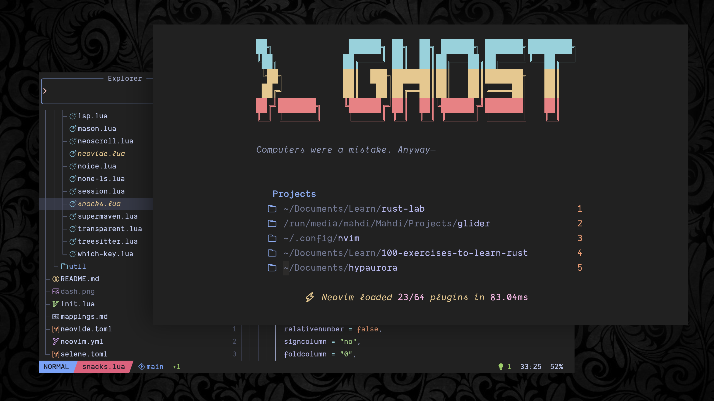

# Ghost · Neovim

Laravel · Rust · Python — crafted with obsession over every UI detail.



## Architecture

- **Plugin manager:** [lazy.nvim](https://github.com/folke/lazy.nvim)
- **Package manager:** [mason.nvim](https://github.com/williamboman/mason.nvim) (+ mason-tool-installer)
- **LSP:** native `vim.lsp.config` / `vim.lsp.enable` driven by nvim-lspconfig and mason-lspconfig
- **Completion:** [blink.cmp](https://github.com/Saghen/blink.cmp) (LuaSnip + friendly-snippets)
- **File explorer:** [oil.nvim](https://github.com/stevearc/oil.nvim)
- **Picker / dashboard:** [snacks.nvim](https://github.com/folke/snacks.nvim)
- **Statusline:** [heirline.nvim](https://github.com/rebelot/heirline.nvim)
- **Syntax:** [nvim-treesitter](https://github.com/nvim-treesitter/nvim-treesitter)
- **Formatting/linting:** [none-ls.nvim](https://github.com/nvimtools/none-ls.nvim)
- **Git:** [gitsigns.nvim](https://github.com/lewis6991/gitsigns.nvim) + [mini.diff](https://github.com/nvim-mini/mini.diff) inline overlays
- **Sessions:** [resession.nvim](https://github.com/stevearc/resession.nvim)
- **Debug:** [nvim-dap](https://github.com/mfussenegger/nvim-dap) + dap-ui

No in-editor terminal.

## Layout

```
init.lua                # bootstrap + leader keys
lua/
├── config/             # options, filetypes, autocmds, mappings, lazy bootstrap
├── util/               # buffer helpers, toggles, icons
└── plugins/            # plugin specs, one file per concern
after/ftplugin/blade.lua
mappings.md             # keymap reference
```

## Install

```shell
mv ~/.local/share/nvim ~/.local/share/nvim.bak  # optional clean slate
git clone https://github.com/taiwbi/ghost ~/.config/nvim
nvim                                            # lazy.nvim bootstraps on first run
```

See `mappings.md` for keybindings.
